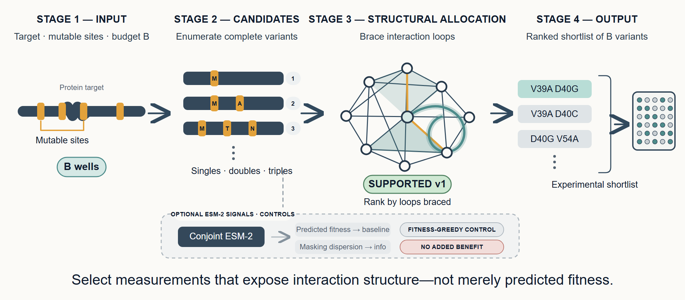
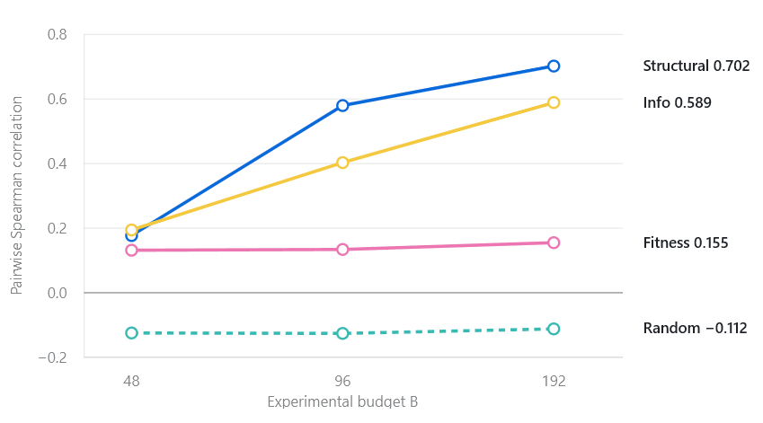

# epibudget

> Rank *B* protein variants that expose mutation interactions, rather than only variants a model
> predicts as fit.

`epibudget` is a Python CLI for budgeted protein experimental design. Its supported strategy selects
variants by the interaction loops they cover. Conjoint ESM-2 scores provide optional fitness and
masking-dispersion signals, and the benchmark keeps those contributions separate.

## The idea in one picture



The design borrows from geodetic triangulation: a measurement network becomes informative when it
closes poorly constrained loops. In a protein landscape, selected variants brace interaction loops
across singles, doubles, and triples.

## Where it sits (and where it doesn't)

| Tool | Question | Stage |
|---|---|---|
| ALDE / BO-EVO | Which variants maximize fitness next? | fitness design |
| **epibudget** | Which variants expose epistatic structure under budget? | structure design |
| [MoCHI](https://github.com/lehner-lab/MoCHI) | Which energies and couplings explain measured data? | inference |

`epibudget` selects measurements. It is neither a fitness optimizer nor an epistasis-inference
package. See [Prior art](docs/PRIOR_ART.md) for the full comparison.

## Quick start

Install from source with Python 3.12 or later:

```bash
git clone https://github.com/VivienP/epistasis-budget.git
cd epistasis-budget
python -m pip install .
```

Rank variants for a target FASTA and write the shortlist to `allocation.json`:

```bash
epibudget allocate --fasta path/to/target.fasta --positions 39,40,41,54 \
  --budget 96 --method structural --model esm2_t12_35M \
  --n-perturbations 0 --out allocation.json
```

Run a smoke-scale GB1 validation after fetching the public dataset:

```bash
python scripts/fetch_gb1.py
epibudget validate --dataset gb1_wu2016 --model esm2_t12_35M --alphabet ACDGV \
  --budgets 48 --seeds 3 --n-perturbations 2 --device cpu
```

This smoke command is not the registered benchmark. Use the frozen settings in
[the validation protocol](docs/VALIDATION.md) to reproduce scientific results.

## The claims we test

> At equal budget *B*, does loop-bracing recover epistatic structure better than fitness-greedy and
> random allocation? Does ESM masking dispersion improve on loop coverage alone?

The benchmark decides GB1 and TrpB separately. It also tests whether each selected plate trains a fixed
learner to rank held-out double and triple mutants. Measured fitness enters only after selection.

## Result

**Partial: structural allocation works; ESM uncertainty does not.** On the completed TrpB 650M profile,
the ESM-weighted method beats fitness-greedy and random for pairwise map recovery, but structure-only
is better at the two larger budgets. Downstream tests on GB1 and TrpB support structural selection over
fitness-greedy and do not support an added benefit from masking dispersion.



The corrective GB1 map-recovery result remains inconclusive. All current comparative results are
provisional; see the [validation protocol](docs/VALIDATION.md) and the
[tracked evidence](artifacts/structural_allocation_650m.json).

## How it works

1. **Score conjointly.** Apply every mutation in a variant before reading ESM-2 conditional
   log-likelihoods, preserving context-dependent interaction signal.
2. **Build the factor graph.** Represent candidate mutations as nodes and pairwise or third-order
   interactions as edges and hyperedges.
3. **Allocate the budget.** Use `--method structural` for the supported loop-coverage strategy.
   `--method info` tests the ESM masking-dispersion weight; `--lambda` blends either graph score with
   predicted fitness.

See [the specification](docs/SPEC.md) for the model and pseudocode.

## Constraints

- Python 3.12 or later; CPU by default, CUDA opt-in with `--device cuda` or `--device auto`.
- Public protein landscapes only; GB1 epistasis analyses use complete, positive-fitness loops.
- The full ESM-2 650M variance-inclusive workflow is not presented as CPU-practical.
- Evidence is limited to two complete four-site landscapes and one fixed downstream learner.
- Masking-perturbation dispersion has not improved on structural allocation.
- `allocate` retains both modes so the ESM contribution remains testable and reproducible.

See [Constraints & limitations](docs/LIMITATIONS.md).

## Reproducing the benchmarks

The [validation protocol](docs/VALIDATION.md) defines the frozen settings and decision rules. GPU run
instructions live in [the 650M runbook](docs/headline_650m_colab.md), with notebooks indexed in
[notebooks/README.md](notebooks/README.md).

## Future Works

- Benchmark structural allocation on 4–6 independent combinatorial protein landscapes before generalizing
  the design model to arbitrary candidate libraries.

## Contributing

See [CONTRIBUTING.md](CONTRIBUTING.md) for the development setup, offline quality gate, and pull-request
requirements.

## Citation & prior art

The scientific background and references are in [Research: epistasis](docs/RESEARCH_EPISTASIS.md).
The positioning against adjacent methods is in [Prior art](docs/PRIOR_ART.md).

## License

MIT.
