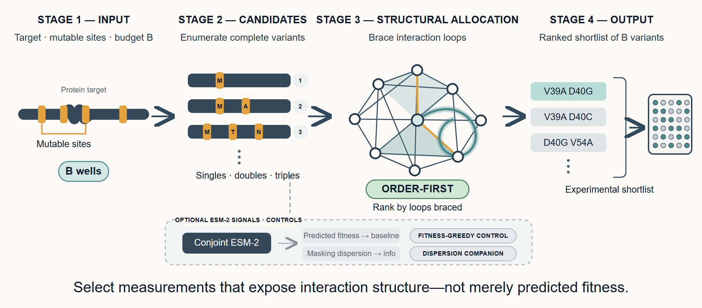

# epibudget

> Rank *B* protein variants that expose mutation interactions, rather than only variants a model
> predicts as fit.

`epibudget` is a Python CLI for budgeted protein experimental design. Its supported strategy selects
variants by the number of interaction contrasts they appear in. Conjoint ESM-2 scores provide optional
fitness and masking-dispersion signals, and the benchmark keeps those contributions separate.

## The idea in one picture



The design borrows from geodetic triangulation: a measurement network becomes more informative as it
covers more of the contrasts you want to estimate. In a protein landscape, selected variants cover
interaction contrasts across singles, doubles, and triples. The implemented objective rewards that
coverage additively; it contains no term for *completing* a contrast, so it does not by itself make
any interaction identifiable.

## Where it sits (and where it doesn't)

| Tool | Question | Stage |
|---|---|---|
| ALDE / BO-EVO | Which variants maximize fitness next? | fitness design |
| **epibudget** | Which variants expose epistatic structure under budget? | structure design |
| [MoCHI](https://github.com/lehner-lab/MoCHI) | Which energies and couplings explain measured data? | inference |

`epibudget` selects measurements. It is neither a fitness optimizer nor an epistasis-inference
package. See [Prior art](docs/PRIOR_ART.md) for the full comparison.

## Quick start

Install from source with Python 3.12 or later:

```bash
git clone https://github.com/VivienP/epistasis-budget.git
cd epistasis-budget
python -m pip install .
```

Rank variants for a target FASTA and write the shortlist to `allocation.json`:

```bash
epibudget allocate --fasta path/to/target.fasta --positions 39,40,41,54 \
  --budget 96 --method structural --model esm2_t12_35M \
  --n-perturbations 0 --out allocation.json
```

Run a smoke-scale GB1 validation after fetching the public dataset:

```bash
python scripts/fetch_gb1.py
epibudget validate --dataset gb1_wu2016 --model esm2_t12_35M --alphabet ACDGV \
  --budgets 48 --seeds 3 --n-perturbations 2 --device cpu
```

This smoke command is not the registered benchmark. Use the frozen settings in
[the validation protocol](docs/VALIDATION.md) to reproduce scientific results.

## The claims we test

> At equal budget *B*, does a coverage-driven plate train a fixed learner to rank held-out double and
> triple mutants better than fitness-greedy and random allocation? Does ESM masking dispersion improve
> on mutation-order coverage alone?

The benchmark decides GB1 and TrpB separately. Measured fitness enters only after selection. The
epistasis-contrast comparison that this project originally headlined is now reported only as a
labelled diagnostic; see [the remediation record](docs/AUDIT_REMEDIATION_20260728.md) and
[protocol amendment 2](docs/specs/prospective-amendment-2.md).

## Result

An [independent mathematical audit](docs/AUDIT_REMEDIATION_20260728.md) withdrew the former
map-recovery claim. The original epistasis-contrast correlation is reproducible, but it is dominated
by lower-order measurements shared algebraically with the ground-truth contrast, and it is sensitive
to method-specific calibration. It is retained as a diagnostic and is **not** interpreted as
epistasis-map reconstruction. The TrpB H1 result is non-decision-eligible under the audit.

What survives is the downstream benchmark, which asks a different question — does a plate train a
fixed learner to rank held-out variants? On two complete four-site landscapes, prioritising
lower-order variants produced training sets from which the same fixed main-effects-plus-pairwise
ridge ranked held-out double and triple mutants better than plates chosen by ESM-2 zero-shot fitness,
random sampling, or the tested practice heuristic:

| log2-budget AUC of S_macro | GB1 | TrpB |
|---|---:|---:|
| `structural` − `fitness` | +0.342 (20/20 partitions) | +0.313 (20/20) |
| `info` − `structural` at B=192 | +0.007 (15/20) | −0.028 (0/20) |

This is a descriptive within-landscape result on two biological case studies, not a cross-protein
generalisation, and the advantage follows primarily from mutation order rather than from
protein-language-model masking dispersion. Both figures come from `epibudget-downstream-v1`; the
seeded tie-break landed afterwards, so they await reproduction under v2 from a clean commit.

For scale: an ESM-2 zero-shot ranking that spends **no budget at all** scores 0.323 on TrpB, against
0.364 for a 48-variant plate and 0.465 for a 192-variant plate.

Scope, stated plainly:

- the former map-recovery claim does not survive the audit in its original form;
- no result establishes that protein language models are generally ineffective for experimental design;
- no result yet establishes cross-protein generalisation — GB1 and TrpB are two biological case
  studies, and the 20 downstream partitions are within-landscape rerandomisations, not 20 independent
  biological replicates;
- the method performs static one-plate allocation, not sequential closed-loop active learning.

In the tracked artifacts, `structural` means interaction-loop coverage, not protein 3D structure. On a
four-site landscape that coverage score takes only three values, so `structural` reduces to "singles,
then doubles, then triples" with a seeded tie-break.

One structural limit is worth stating plainly: a contrast over a residue pair the plate never assays
is **exactly unidentifiable** by this learner — its predicted value is a constant, not an estimate.
With 2,166 pairwise terms and a budget of 192, at most ~9% of pairwise contrasts can ever be
identified. That is why this project reports variant ranking and not landscape reconstruction. All
findings remain provisional and limited to the evaluated landscapes, learner, and protocol.

Read the [project write-up](https://vivienperrelle.com/journal/designing-protein-experiments-for-epistasis)
for a longer account of the work.

## How it works

1. **Score conjointly.** Apply every mutation in a variant before reading ESM-2 conditional
   log-likelihoods, preserving context-dependent interaction signal.
2. **Build the factor graph.** Represent candidate mutations as nodes and pairwise or third-order
   interactions as edges and hyperedges.
3. **Allocate the budget.** Use `--method structural` for the supported coverage strategy.
   `--method info` weights that coverage by ESM masking dispersion (it requires
   `--n-perturbations > 0`); `--lambda` blends either graph score with predicted fitness. The
   objective is a prior trace reduction under a diagonal masking-dispersion prior — it contains no
   loop-closure term, so it does not reward completing a contrast.

See [the specification](docs/SPEC.md) for the model and pseudocode.

## Constraints

- Python 3.12 or later; CPU by default, CUDA opt-in with `--device cuda` or `--device auto`.
- Public protein landscapes only; GB1 epistasis analyses use complete, positive-fitness loops.
- The full ESM-2 650M variance-inclusive workflow is not presented as CPU-practical.
- Evidence is limited to two complete four-site landscapes and one fixed downstream learner.
- Masking-perturbation dispersion has not improved on structural allocation, and it is not a
  calibrated uncertainty: it correlates -0.113 (95% CI [-0.220, -0.002]) with real prediction error.
- On a four-site landscape the coverage score is three-valued, so `structural` needs a declared
  tie seed to be reproducible.
- `allocate` retains both modes so the ESM contribution remains testable and reproducible.

See [Constraints & limitations](docs/LIMITATIONS.md).

## Reproducing the benchmarks

The [validation protocol](docs/VALIDATION.md) defines the frozen settings and decision rules. GPU run
instructions live in [the 650M runbook](docs/headline_650m_colab.md), with notebooks indexed in
[notebooks/README.md](notebooks/README.md).

## Future Works

- Benchmark structural allocation on 4–6 independent combinatorial protein landscapes before generalizing
  the design model to arbitrary candidate libraries.

## Contributing

See [CONTRIBUTING.md](CONTRIBUTING.md) for the development setup, offline quality gate, and pull-request
requirements.

## Citation & prior art

The scientific background and references are in [Research: epistasis](docs/RESEARCH_EPISTASIS.md).
The positioning against adjacent methods is in [Prior art](docs/PRIOR_ART.md).

## License

MIT.
